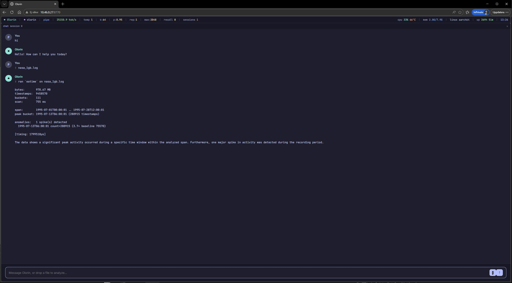

# Runes — the full catalog



*Drop a file into the web UI and a rune analyzes it on-device: here a 1 GB
NASA-HTTP access log (July 1995) is SIMD-scanned in 755 ms, a real traffic
spike flagged on the 13th, and narrated by the local model — zero cloud,
on a Raspberry Pi.*

> A *rune* is a SIMD-first command. Each one is one Ea kernel plus a thin Rust
> orchestrator that turns MB-scale raw data into a small structured summary
> in sub-second time. The language model never sees the raw bytes — only the
> kernel's output, which it phrases in one or two plain-English sentences.

Runes are how Olorin reasons over data larger than the model's context window.
Olorin runs Gemma 4 E2B with a 2,048-token window; a modest bank statement is 50 MB.
A rune compresses the file losslessly along the dimensions that matter
(counts, ranges, top-N values, distributions), so the model can narrate
findings without ever holding the full file in its head.

Output is wrapped in `<rune_output untrusted="true">...</rune_output>` and
runs through the inbound safety scan before reaching the LLM turn — file-derived
bytes are always treated as data, never instructions.

**Correctness & robustness.** Each rune's counts are differentially validated
against the standard tool for its format (pandas, pyarrow, a real SQLite engine,
numpy) on real public files at scale — the per-rune notes below cite the
specific oracle and dataset. Beyond correctness, every rune parser is
continuously fuzzed against panics, hangs, and silent-wrong output (mutation
fuzzing over real-file seeds; see `tests/fuzz_runes.rs`), as are the tokenizer
(`tests/fuzz_tokenizer.rs`) and the encrypted vault's crash recovery
(`tests/vault_crash_fuzz.rs`, randomized on-disk crash-state injection) — run on
both x86 and Raspberry Pi NEON, each harness paired with a negative control that
proves it can fail.

The eight runes:

- [`eacrunch`](#eacrunch--csv-summarizer) — CSV summarizer
- [`eajson`](#eajson--json-lines-summarizer) — JSON Lines summarizer
- [`eaparquet`](#eaparquet--parquet-metadata-summarizer) — Parquet metadata
- [`ealog`](#ealog--log-severity-scanner) — log severity scanner
- [`eatime`](#eatime--iso-8601-timestamp-histogram) — timestamp histogram + chronological spike detection
- [`easql`](#easql--sql-dump-summarizer) — SQL-dump summarizer (`pg_dump` / `mysqldump`)
- [`eacorrelate`](#eacorrelate--cross-file-lag-correlation) — cross-file lag correlation
- [`eadiff`](#eadiff--structural-delta-between-two-rune-runs) — structural delta between two rune runs

The `--json` flag on any rune emits the same data as machine-readable JSON Lines
for piping into another rune. See [`--json` mode](#--json-mode) below for the
chaining contract. `olorin report <files…>` renders the same pipeline as one
self-contained HTML file — see [HTML reports](#html-reports).

---

## eacrunch — CSV summarizer

```
/rune eacrunch ~/Downloads/statement.csv
```

```
rows: 1247
columns: 4
date (text): 340 unique; top values: 2024-01-15, 2024-02-10, 2024-03-05
category (text): 8 unique; top values: groceries, food, rent
amount (number): count=1247, mean=46.70, min=1.00, max=1850.00, sum=58235.00
merchant (text): 42 unique; top values: Coop, ICA, SL
```

### GROUP BY — `--by <col> [--agg <op:col,...>]`

Aggregate rows grouped by one column instead of summarizing the whole file.
`--agg` takes comma-separated `op:col` pairs (`sum`/`mean`/`min`/`max`) plus a
bare `count`; with no `--agg`, you get the per-group row count (SQL's
`SELECT col, count(*) … GROUP BY col`).

```
/rune eacrunch --by category --agg sum:amount,mean:amount ~/statement.csv
```

```
group by category: 8 group(s) over 1247 rows
  groceries — count=412  sum(amount)=19204.50  mean(amount)=46.61
  food — count=298  sum(amount)=8810.00  mean(amount)=29.56
  rent — count=12  sum(amount)=22200.00  mean(amount)=1850.00
  …
```

Groups are ordered biggest-first (count descending, key ascending on ties),
so the output is deterministic and cross-arch bit-identical. The human-readable
view caps at 40 groups; `--json` emits every group. Aggregated values use the
same finite-only (skip `NaN`/`inf`) rule as whole-column stats, so a group's
`mean(amount)` agrees with the column's `mean` by construction — differentially
verified against pandas `groupby().agg()` on the 3M-row NYC-taxi file (0
mismatches). Grouping a column with more than ~1M distinct values fails with a
clear "high cardinality" error rather than exhausting memory.

### WHERE — `--where <col><op><value>`

Filter rows *before* aggregating (or before whole-column stats, standalone).
One predicate; operators `=` `!=` (string) and `>` `>=` `<` `<=` (numeric — a
non-numeric cell never satisfies an ordered comparison).

```
olorin rune eacrunch --where 'total_amount>20' --by payment_type --agg sum:trip_distance access.csv
```

`--where` composes with `--by`/`--agg` (`SELECT … GROUP BY … WHERE …`) and
also works alone for filtered column summaries; `totals.rows` then reports the
matched-row count. Differentially verified against pandas (`df[df.col > v]`) on
the 3M-row NYC-taxi file. **Shell note:** quote predicates containing `>`/`<`
on the command line (`--where 'temp>29'`) or the shell reads them as
redirections; the REPL, web UI, and tool-call paths need no quoting.

## eajson — JSON Lines summarizer

```
/rune eajson ~/Downloads/access.log.jsonl
```

```
rows: 1000
keys: 7 (+12 high-cardinality keys suppressed)
ts (timestamp): 1000 unique of 1000; range: 2026-05-06T08:00:00Z .. 2026-05-06T08:42:13Z
status (number): count=1000, mean=232.10, min=200.00, max=503.00, sum=232100.00
method (text): 4 unique; top values: GET, POST, HEAD
src_ip (text): 47 unique; top values: 1.2.3.4, 10.0.0.5, 192.168.1.10
http.user_agent (text): 12 unique; top values: curl/7.68, Mozilla/5.0, Nikto
cached (bool): true=623, false=377
MESSAGE (text): 8 unique; top values: GET /index, POST /api/auth, GET /admin
```

eajson handles real systemd / container / web-server log shapes: nested objects
flatten to `parent.child` keys, byte-array MESSAGE fields (systemd's binary
format) decode as UTF-8, ISO-8601 timestamp fields report a `min..max` range,
and high-cardinality noise (cursors, sequence IDs) is suppressed with a count
notice. Escape sequences in strings (`\"`, `\\`, etc.) are correctly handled
by the kernel via a 5th match character (backslash) and an odd-run filter in
the orchestrator.

## eaparquet — Parquet metadata summarizer

```
/rune eaparquet ~/data/transactions.parquet
```

```
rows: 10000000
columns: 4
id (number): values=10000000, min=1.00, max=10000000.00, nulls=0
category (text): values=10000000, nulls=12 [byte-array column; min/max not decoded]
amount (number): values=10000000, min=0.50, max=9999.99, nulls=0
is_recurring (bool): values=10000000, nulls=0
```

Reads only the file footer — Parquet writers pre-compute per-column
min/max/null_count at write time and store them in the metadata. The rune walks
the footer (Thrift compact decoder, scalar — no SIMD path exists for
variable-length encodings) and aggregates per-column statistics across row
groups via the `f64_stats` SIMD kernel. For a file with N row groups and C
columns, that's `3*C` kernel calls each doing an N-element f64x2 reduction —
real SIMD work that scales with file size.

**Limit**: column-data SIMD decoding (PLAIN/RLE/dictionary encoding +
snappy/gzip/zstd decompression) is out of scope for v1. Statistics must be
present in the file metadata (most modern writers include them by default).
BOOLEAN/INT32/INT64/FLOAT/DOUBLE get min/max; **INT96** (legacy Spark/Hive/
Impala timestamps) decode to ISO instants, and **DECIMAL** columns decode to
their scaled value (`unscaled / 10^scale`, including FIXED_LEN_BYTE_ARRAY
big-endian two's-complement). BYTE_ARRAY (strings) are reported by type with
stats absent. Note: many writers omit statistics for INT96 (its sort order is
undefined), so a real INT96 column is often labeled a timestamp with no
min/max to show.

## ealog — log severity scanner

```
/rune ealog ~/var/log/app.log
```

```
bytes:   1.2 GB
lines:   47123891
format:  plaintext
scan:    162 ms

severity:
  DEBUG       1234567  ( 2.62%)
  INFO       44000000  (93.38%)
  WARN         789012  ( 1.67%)
  ERROR         23456  ( 0.05%)
  FATAL            12  ( 0.00%)

high-severity sample:
  L42179:    FATAL bootstrap: cannot bind 0.0.0.0:443: address in use
  L8129441:  ERROR upstream: timeout reading from backend (5s)
  L8129502:  ERROR upstream: timeout reading from backend (5s)
```

Counts word-bounded `DEBUG / INFO / WARN / ERROR / FATAL` occurrences, the
total line count, and records byte offsets of up to 5 ERROR/FATAL matches —
all in one SIMD pass through the file. Word boundary check (delimited by
space, tab, newline, CR, `[`, `]`, `"`, `:`) catches the common formats —
plaintext (`[INFO] ...`), JSONL (`"level":"ERROR"`), and systemd
(`Jan 01 12:00 host: INFO`) — without false positives on identifiers like
`ERROR_HANDLER`.

The kernel is cross-arch in a single `.ea` source: it avoids the `movemask`
primitive (x86-only) in favor of `select` + integer `reduce_add` over a
0x01-where-match lane mask. Position recording uses the same store-to-scratch
+ scalar-walk pattern as `csv_scan` / `jsonl_struct`. **Measured 0.70 GB/s on
Ryzen 7700X WSL2, 0.43 GB/s on Pi 5 Cortex-A76 NEON**, identical bit-exact
counts across both architectures.

## eatime — ISO-8601 timestamp histogram

Grab a real input — a few hours of public GitHub event data (every event
carries an ISO-8601 `created_at`):

```bash
curl -s https://data.gharchive.org/2015-01-01-{12,16,20}.json.gz | gunzip > ~/gharchive.log
```

```
/rune eatime ~/gharchive.log
/rune eatime --bucket weekday ~/gharchive.log
/rune eatime --bucket series ~/gharchive.log
/rune eatime --bucket series ~/access.log     # Apache/nginx CLF, auto-detected
```

```
bytes:       72.00 MB          # Raspberry Pi 5 Model B, aarch64
timestamps:  68140
scan:        27 ms

hour-of-day:
  11:00          681  ( 1.00%)
  12:00        13750  (20.18%)   <- 12:00 archive
  13:00          669  ( 0.98%)
  ...
  16:00        20270  (29.75%)   <- 16:00 archive
  ...
  20:00        22179  (32.55%)   <- 20:00 archive
  21:00          645  ( 0.95%)
  ...
peak: 20:00 (22179 timestamps)
```

The three spikes are the hours pulled from the archive (the events' own
`created_at`); the background counts are timestamps embedded in the event
payloads — repo, comment, and actor times across the rest of the day.

One SIMD pass to find every timestamp occurrence of the detected grammar in the
buffer — log lines, CSV cells, JSONL values, any position. Per-hour counts bucketed
scalar after the SIMD scan. All 24 hour-of-day slots are always emitted (even
when count is 0) so downstream `eadiff` chaining is deterministic.

The kernel uses the same cross-arch idiom as `log_level_scan`: structural
anchors (`-`, `-`, `T` at offsets 4, 7, 10) detected via SIMD `.==` lane masks,
`reduce_add` to detect any candidate in the chunk, scalar-walk to validate the
8 digit positions. Single `.ea` source; same primitives lower cleanly to x86
SSE2 (Ryzen 7700X) and ARM NEON (Pi 5 Cortex-A76) with bit-exact bucket counts.

**Kernel throughput (isolated): 6.34 GB/s on Ryzen 7700X WSL2, 1.80 GB/s on Pi 5
Cortex-A76 NEON**, on a 100 MB synthetic log with 1.45M timestamps (every line).
Reproduce with `gcc -O2 benchmarks/timestamp_scan_bench.c -ldl && ./a.out
<path/to/libtimestamp_scan.so>`. End-to-end the rune is density-dependent: the GH
Archive run above (~1 timestamp per KB) scans 72 MB in 27 ms (~2.7 GB/s) on the
Pi 5; a dense every-line log shifts the cost to the per-match scalar walk and
runs ~1.4 GB/s. The structural-anchor filter is cheaper per byte than
`log_level_scan`'s keyword AND-chains — fewer SIMD lane masks per 16-byte chunk,
scalar walk only on the (rare) candidate hits.

eatime auto-detects three timestamp grammars and dispatches the matching SIMD
kernel: **ISO-8601** `YYYY-MM-DD[T| ]HH:MM:SS` — the `T`-separated RFC-3339 form
(JSON logs, container/k8s output, `journalctl -o short-iso`) **and** the
space-separated variant Postgres / MySQL / Python-`logging` / OpenStack emit
(`2024-01-01 15:00:00.123`, fractional seconds ignored) — via `timestamp_scan`;
**classic BSD syslog** `MMM DD HH:MM:SS` (`Jun 14 15:16:01`, the Linux
`/var/log` / sshd / cron / network-gear default, including the space-padded
`Jun  4 …`) via `syslog_scan`; and **Common Log Format**
`[dd/MMM/yyyy:hh:mm:ss]` (the Apache/nginx access-log default) via `clf_scan`.
Detection runs both kernels over a 64 KB head and picks whichever matches more,
so the sniff can never disagree with the scan; force it with `--format iso|clf`.
Every hit is decoded to epoch-seconds, so all three bucket modes work on both
grammars. Legacy space-separated syslog (`Jun  4 02:13:01`, no year) stays out
of scope — extending it needs a per-format kernel and a year-inference policy.

`--bucket weekday` swaps the 24-hour histogram for a 7-bucket Mon..Sun view
derived from the decoded instant (epoch day 0, 2000-01-01, is a Saturday). Same
kernel pass, different scalar post-processing. Use it for "Tuesday-morning
errors" style questions.

### `--bucket series` — chronological histogram + spike detection

Where `hour`/`weekday` collapse the time axis (every Monday lands in one slot),
`--bucket series` keeps it. It decodes each kernel position to a full instant,
bins the file's span into auto-width buckets (snapped to a "nice" width —
1s/5s/…/1h/1d/1w — targeting ~120 buckets), and runs a deterministic spike pass
over the count series. eatime stops *describing* the file and starts telling you
*when the rate broke*:

```
> /rune eatime --bucket series ~/journal-24h.log    # real systemd journal, last 24h
timestamps:  7629
buckets:     48
scan:        1 ms
span:        2026-06-03T09:01:37 .. 2026-06-04T08:31:37
peak bucket: 2026-06-03T23:01:37 (207 timestamps)
anomalies:   4 spike(s) detected
  2026-06-03T13:01:37 count=206 (1.3× baseline 154)
  2026-06-03T22:31:37 count=199 (1.3× baseline 154)
  2026-06-03T23:01:37 count=207 (1.3× baseline 154)
  ...
```

The baseline is the **median** bucket count and the spread is the **MAD**
(median absolute deviation) — robust by construction, so a large spike can't
inflate its own threshold and hide the way a mean/σ pair would. A bucket is
flagged when its robust z-score `(count − median) / (1.4826·MAD)` clears 4
(`Z_THRESHOLD`). Only upward spikes are reported; dips are out of scope. When
the series is perfectly flat (MAD = 0) the z-score is undefined, so detection
falls back to a ratio test (≥ 3× median, with a 10-event absolute floor). The
flags above are 7–9σ events — modest in ratio (1.3×) but statistically
unmistakable because the journal's baseline rate is so stable.

In `--json` mode each spike is an entry in an additive `anomalies[]` array
(`bucket`, `count`, `baseline`, `ratio`, `score`); the array is omitted when
empty, so every pre-existing `--json` consumer (and `eadiff`) is byte-for-byte
unaffected. The full chronological series is always in `categories[]`. Bucket
counts are validated bit-for-bit against an independent pandas/regex grouping on
real data (313K-timestamp systemd journal) via `benchmarks/eatime_diff.py`.

## easql — SQL-dump summarizer

```
/rune easql ~/dumps/Chinook_MySql.sql
```

```
dialect: mysql
tables:  11
rows:    15607
scan:    1 ms

rows by table:
  PlaylistTrack                8715
  Track                        3503
  InvoiceLine                  2240
  Invoice                      412
  Album                        347
  Artist                       275
  Customer                     59
  Genre                        25
  Playlist                     18
  Employee                     8
  MediaType                    5
```

Drop a `pg_dump` or `mysqldump` `.sql` file and `easql` reports the dialect,
table count, and per-table row + column counts — without executing a line of
SQL. The `sql_scan` kernel sweeps the whole file once for word-bounded
`CREATE` / `INSERT` / `COPY` keywords (case-insensitive) plus newlines,
recording each keyword's byte offset; the rune then nibbles a bounded region
per marker: read the table name (`bare`, `"quoted"`, `` `backtick` ``, or
`schema.table`), count columns from the `CREATE TABLE (…)` block (top-level
commas), and count rows per statement.

Row counting follows the dump shape. A Postgres `COPY t … FROM stdin;` block
counts the newlines between the header `;` and the `\.` end marker. A
`INSERT … VALUES (…),(…)` statement counts top-level value tuples,
single-quote-aware (so a `),(` *inside* a string value doesn't inflate the
count) and skipping the optional column list (`INSERT INTO t (c1, c2) VALUES …`,
which would otherwise read as one extra row). Tables split across many INSERT
batches accumulate.

Dialect is detected structurally, not by trusting a header comment: `COPY` →
postgres (Postgres-only bulk-load syntax); a backtick anywhere → mysql (MySQL's
identifier quote, which Postgres never emits); a `pg_catalog` / `\connect` /
`standard_conforming` fingerprint → postgres even for `pg_dump --inserts` (which
has no COPY blocks); otherwise an honest `sql`.

Output maps tables onto the v1 `categories` contract (`name` = table, `count` =
rows), so the block-bar chart, the `--json` pipe, and `eadiff` all work on a
SQL dump for free — diff two nightly dumps to see which tables grew. Verified
per-table against a real SQLite engine on the Chinook `mysqldump` + `pg_dump`
(0 mismatches, 15 607 rows) on Pi 5 NEON, and guarded by a pinned-stack
large-dump canary. It is a *summarizer*, not a SQL parser: it sweeps and
nibbles, never builds a parse tree.

## eacorrelate — cross-file lag correlation

```
/rune eacorrelate ~/logs/syslog ~/deploys.csv
```

```
events:      902
streams:     3
scan:        1.4 ms

  syslog                              847
  syslog (errors)                      52
  deploys.csv                           3

correlations: 1 finding(s)
  syslog (errors) follows deploys.csv by +240s (r=0.93, peak 2026-06-11T03:02:00, bucket 60s)
```

Takes 2–8 timestamped files (ISO-8601, CLF, syslog, or **JSON / ndjson**,
auto-detected per file) and answers "what happened across these?": every file
contributes its event stream, ISO/syslog/JSON logs contribute a second
ERROR/FATAL keyword sub-stream and CLF access logs an HTTP-**5xx** sub-stream
(so an nginx deploy→500s incident is visible, not just keyword-logged app
errors), all streams are
bucketed onto **one** shared time grid (512 target buckets — finer than
eatime's 120 because lag resolution *is* bucket width), z-scored, and every
cross-file pair is swept over ±128 lags by the `corr_sweep` kernel. A finding
is the **per-window Pearson r** of the lag-aligned overlap windows —
positive-only (negative rate-correlation across event files is the
disjoint-recording-period artifact, not behavior), and only when both
windows hold ≥ 3 actual events: a correlation claim requires both streams
*active* in the compared window, so files from different eras correctly
report nothing. Findings are direction-normalized so `stream_a` always
*follows* `stream_b` by `lag_seconds`. The strongest three land in the
additive `correlations[]` block (`--json`), each carrying `peak_bucket`
(the instant of strongest co-occurrence) and `width_seconds` (the honest
lag resolution). Verified against an independent numpy oracle on
randomized planted-lag, independent-noise, and disjoint-era scenarios
(`benchmarks/eacorrelate_diff.py`, 18/18). Reported lags are bounded by an
absolute ceiling (1 h — an incident cascade is minutes, not hours), which also
rejects the ±24 h diurnal phase-alignment that two overlapping logs of the same
system would otherwise manufacture (a real srv1174152 syslog/auth pair scored a
spurious "+16 h" before the ceiling).

Dropping ≥ 2 files into the web UI runs it automatically: the findings stream
after the per-file kernel outputs and lead the narration, so the model opens
with the conclusion. When nothing correlates, no block appears — silence is
the honest finding.

### Incident timeline

When the correlations form a cascade, eacorrelate assembles them into a single
ordered story — the additive `incident` block (`--json`), and the headline of
the text/narration output:

```
incident timeline (confidence 0.95):
  Deployment at 02:00
  -> app errors rise 4 minutes later (r=0.93)
  -> request traffic drops 12 minutes later (anomaly 0.95)
```

It finds the cascade **root** (a stream that leads but never follows), **anchors**
on it, and orders the followers by cumulative lag. When a discrete *trigger* event
— even a single deploy-log line, too sparse to be a correlation stream itself —
sits at the inferred root instant, the anchor snaps onto it and the lags re-base
onto the deploy, so the story names the cause (`Deployment at 02:00`) instead of
the first error stream. Two kinds
of follower step: a **correlated** rise (a co-spiking stream, carrying its Pearson
`r`) and a signed **drop** (`anomaly`): a stream that instead *falls* within the
incident window, detected as a downward robust-median/MAD break — kept as an
observation, never a negative correlation (which would reopen the disjoint-era
artifact). `confidence` is the **weakest link** — `min` over the steps' scores.

The wording is deliberately temporal — "errors rise 4 minutes later", never "the
deploy *caused* it" — and a zero-lag step reads "at the same time" (co-occurrence,
not a cascade). A correlation over too few overlap buckets is rejected (the guard
that killed a real NASA `+654 h, r=1.00` artifact). No cascade → no `incident`.

## eadiff — structural delta between two rune runs

```
/rune eatime --json ~/yesterday.log > /tmp/y.json
/rune eatime --json ~/today.log     > /tmp/t.json
/rune eadiff /tmp/y.json /tmp/t.json
```

```
fields-diffed:     0
categories-diffed: 2

category deltas:
  +06:00            3
  -07:00            1
```

Two prior `--json` rune outputs in; one `RuneOutput` carrying signed deltas
out. Match-by-name across `fields[]` and `categories[]`, across every
`FieldKind`:

- **Number** — signed deltas on min/max/mean/sum.
- **Bool** — paired Number fields `<col>.true_delta` and `<col>.false_delta`
  carrying signed deltas of each count.
- **Timestamp** — `<col>.unique_delta` (signed change in unique-value count)
  plus `<col>.min_shift_s` and `<col>.max_shift_s` carrying the signed
  second-deltas of the range endpoints. Forward by one day reads as
  `+86400.00`. Garbage ISO strings skip the shift fields silently (no crash,
  no fake values).
- **Text** — `<col>.unique_delta` plus per-value top-N comparison. Values
  present in both runs' top-N with different counts emit as
  `<col>:<value>.count_delta` (signed delta in `numeric.mean`). Values
  appearing in only one side emit as `[appeared in top] <col>:<value>` /
  `[disappeared from top] <col>:<value>` Mixed markers.
- **Categories** — directional naming: a bucket that grew emits as `+<name>`,
  one that shrank as `-<name>`. Unchanged buckets omitted.
- **Asymmetric keys** (present in one input but not the other) — emitted as
  `[appeared] <name>` / `[disappeared] <name>` with kind=Mixed and count from
  the originating side. The bracket prefix is unambiguously not a real
  upstream field name.

eadiff is *generic*: the same code handles `eatime × eatime` (hour- or weekday
drift), `eacrunch × eacrunch` (numeric column drift), `eaparquet × eaparquet`
(footer-stat drift), `eajson × eajson` (any key kind) — never branches on which
rune produced the inputs. That's the v0.9.0 schema paying off.

---

## `--json` mode

Every rune accepts `--json`:

```
/rune eacrunch --json ~/today.csv
```

Output is one compact JSON object per line — a `RuneOutput v1` serialization
with stable keys (`schema_version`, `rune`, `source`, `totals`, `fields[]`,
`categories[]`, `samples[]`, and the optional `anomalies[]` — emitted only by
`eatime --bucket series` and only when non-empty). Refusal paths emit JSON too (with `success:false`
and `error`), so a chained downstream rune always reads a parseable
`RuneOutput` instead of choking on free-form text.

This is the *chaining contract*. The structured form is the same data the
human-readable text view shows — text and JSON cannot drift, because both are
rendered from a single in-memory `RuneOutput`. Downstream consumers like
`eadiff` read `RuneOutput` back via `RuneOutput::from_json` and operate on the
union of `fields[]` and `categories[]`.

`--json` explicitly opts out of LLM involvement. The structured JSON answer is
emitted verbatim — no `<rune_output untrusted="true">` wrapping (would break
parseability for downstream runes), no `[timing: …]` footer (would break JSONL
parseability), no LLM narration (the user asked for machine output). The
safety scan still runs on the raw JSON bytes, so prompt-injection patterns
inside file-derived string values (CSV cells, JSON value strings, text-top
entries) are blocked regardless of format.

## Real public data to try it on

- **Synthetic fixtures** — `tests/fixtures/runes/{tiny.csv,tiny.jsonl}` in this
  repo. Small, good for a smoke test.
- **systemd journal** — `journalctl -o json -n 1000 > /tmp/log.jsonl` then
  `/rune eajson /tmp/log.jsonl` — real local data, no setup.
- **nginx / app logs** — point `/rune ealog` at any access log or app log on
  disk for a severity histogram + first 5 high-severity samples in milliseconds.
- **US Bank Transaction Categories v2** — 68K real transaction descriptions,
  MIT-licensed (CSV):
  https://huggingface.co/datasets/DoDataThings/us-bank-transaction-categories-v2
- **NYC TLC Yellow Taxi trip records** — millions of rows per month,
  permissive (CSV):
  https://catalog.data.gov/dataset/2023-yellow-taxi-trip-data

## Limits

- **Max input**: 4 GB (2 GB for the `csv_scan` / `jsonl_struct` kernels in this
  version — bumping to i64 is a planned follow-up).
- **Path allowlist**: `~` and `/tmp` only. Symlinks escaping the allowlist are
  rejected at open time.
- **Output cap**: 32 KB summary (truncated with a `[...truncated N bytes]`
  marker at a UTF-8-safe boundary).
- **eacrunch**: unquoted CSV only; CRLF line endings tolerated (trailing `\r`
  trimmed per field). GROUP BY (`--by`/`--agg`) caps at ~1M distinct group
  keys (fails loud past that); the human table shows the top 40 groups,
  `--json` all of them.
- **eajson**: nested objects flatten to dotted keys (`http.req.headers.ua`)
  up to `--depth N` levels (default 4; `--depth 0` = top-level keys only).
  Arrays-of-objects are still skipped (only systemd byte-array `MESSAGE`
  fields are decoded). Mixed-type keys (number on one line, string on
  another) collapse to `(mixed)` with no stats. Text top-N capped at 10K
  cardinality.
- **eaparquet**: metadata-only — column data is never decoded. Statistics must
  be present in the file footer. INT96 timestamps decode to ISO instants and
  DECIMAL columns to their scaled value; BYTE_ARRAY (string) min/max are not
  decoded. Flat schemas only; nested groups (LIST/MAP/STRUCT children) are
  skipped from the column list.
- **ealog**: severity keywords (`DEBUG/INFO/WARN/ERROR/FATAL`) matched
  **case-insensitively** since v2.0.8 — `info`, `INFO`, and `Error` all count —
  bounded by `space/tab/newline/CR/[/]/"/:`. Compound identifiers like
  `ERROR_HANDLER` are not counted (`_` is not a boundary, so they stay one
  token). Severity values inside JSON-style logs (`"level":"info"`) *do* count,
  since `"` and `:` are boundaries. Sample buffer caps at 5 lines; counts
  remain accurate past that.
- **eatime**: three grammars, auto-detected (or forced with
  `--format iso|clf|syslog`): ISO-8601 `YYYY-MM-DD[T| ]HH:MM:SS` (both the `T`
  and space separators; a trailing `_` — as in some filename stamps — is *not*
  matched), Common Log Format `[dd/MMM/yyyy:hh:mm:ss]`, and classic BSD syslog
  `MMM DD HH:MM:SS`. **Syslog is yearless**, so a fixed reference year is
  assigned: hour/series buckets and cross-file lags (which use only time
  *differences*) are exact, but the displayed year and the `weekday` bucket are
  placeholders, and correlating two syslog files from *different real years* may
  falsely overlap. A file that wraps Dec→Jan is assumed single-year. Other
  formats (Unix epoch, RFC 2822, freeform) are out of scope — each needs its own kernel, and yearless formats need a
  year-inference policy. CLF's `±HHMM` zone is ignored (bucketing is on the log's
  own wall clock; a constant zone cancels out of bucket indices). Buckets cap at 16M
  positions per call. `--bucket series` auto-selects bucket width (1s…1w,
  ~120 buckets), flags upward spikes only via a robust median/MAD z-score
  (threshold 4, with a ≥3×/10-event ratio fallback for flat series), and
  needs ≥ 8 buckets before it will flag anything.
- **easql**: a summarizer, not a SQL parser — it sweeps `CREATE`/`INSERT`/`COPY`
  and nibbles per marker. Row counts cover `pg_dump` COPY blocks and
  `INSERT … VALUES` (both `mysqldump` and `pg_dump --inserts` /
  `--skip-extended-insert`); a `CONSTRAINT` line inflates a table's column count
  slightly. The sweep is chunked over newline-aligned windows, so per-table
  attribution is exact regardless of statement count — a million single-row
  INSERTs attribute as accurately as a few batched ones. 2 GB max input
  (`sql_scan` is i32-indexed).
- **eadiff**: matches by exact field/category name across the two inputs.
  Every `FieldKind` is diffable. Stdin chaining (`-` for one of the two path
  args) is not yet wired through the rune dispatcher — both inputs must be
  files for now.
- **Narration**: the model gets a token budget of ~1248 prompt + 768 decode.
  Outputs over that skip narration with a clear notice — the kernel summary
  is shown either way.

## HTML reports

```
olorin report syslog.log deploys.csv access.log -o incident.html
```

Runs the deterministic file-drop pipeline — `pick_rune` per file, `eacorrelate`
across them when two or more carry timestamps — and writes **one self-contained
HTML file**: inline CSS, inline SVG charts, zero external assets, zero
JavaScript. It opens anywhere, prints cleanly, and survives being emailed,
which makes it the artifact to attach to an incident ticket.

Structure mirrors the investigation: cross-file correlation findings first
(conclusion before evidence), then one section per file with its stats,
time-series chart (same `col_reduce`-kernel column envelope as the terminal
block bars — every surface agrees about the data; anomaly buckets tinted red),
and flagged spikes. The model is never involved: same inputs, same report.
Every file-derived string is HTML-escaped.
